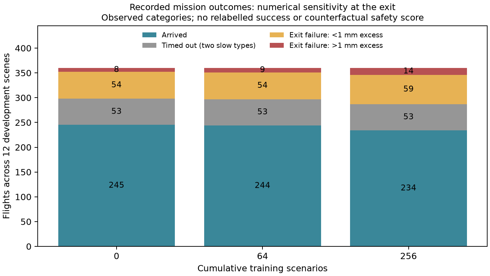

# 256轮学习诊断

2026-09-06。结论：尚未形成有效避让策略；已确认出口成功判定对微米级误差敏感、两类慢机型在当前探索速度下持续超时，同时训练规模仍远小于原文。PPO确实更新参数，价值预测已有改善。现有证据不支持把原因简单归结为学习率错误、优化器不工作或原文方法无效。

## 本次实际做了什么

保留正式模型/Adam/RNG/配置、奖励、观测和导航。使用原collector逐机GAE，在原12开发场景重放初始/64/256共36次、1080架次；每次人口、动作直方图、风险和全部科学摘要与既存记录精确一致，排除计时/RSS字段。新增只读物理回调保存出口穿越，逐次核对原环境穿越计数，成功架次必须有对应有效穿越。

冻结256模型在四个已用训练场景seed9500000–9500003采15903样本（120架），三模型在完全相同输入/mask上比較概率与价值。仅对可丢弃model/Adam副本作一次四场景PPO更新及8个固定小批次的梯度分解；不保存成新训练checkpoint，不增加正式256计数。独立脚本核对1200条逐机轨迹、160423条决策的奖励、终止、GAE和Monte Carlo回报。

[诊断源码](../../src/learning_diagnosis.py) · [独立归约源码](audit.py) · [完整结果](records/20260906T010713Z-learning-diagnosis-original12-2aac1384/artifacts/result.json) · [独立审计](records/20260906T011711Z-learning-diagnosis-trace-audit-5ff0a846/artifacts/audit.json)。无held-out、新训练种子效果或因果消融结论。

## 1. 最先应处理：出口终止的数值敏感性

[finite_exit_crossing](../../src/route_completion.py)将出口半宽设为76.2m，容差只有1e-7m（0.1微米），而合法lane目标恰好包括±76.2m。飞过出口时仅有极小偏差就失去arrival+1，并最终记为路线耗尽。诊断发现所有下表微小偏差例的请求都在合法边界lane上，高度符合要求。

| 模型 | 原成功架次 | 慢机超时 | 出口失败，偏差≤1mm | 出口失败，偏差>1mm |
| --- | ---: | ---: | ---: | ---: |
| 初始 | 245 | 53 | 54 | 8 |
| 64 | 244 | 53 | 54 | 9 |
| 256 | 234 | 53 | 59 | 14 |

256的59例实际偏差仅0.101–30.990微米，远小于1mm分组阈值；中位全部73出口失败偏差约0.429微米。例：seed53001/F002/Eh216在454.75s穿越，横坐标−76.20000013158568m、目标−76.2m，高度137.16m有效，仅超出0.132微米却被判失败。另有真实较大偏离，最大26.193m，不能一并算成数值问题。

64→256的原始10架完成净下降，分类计数为微小偏差失败增加5、较大偏差失败增加5，超时不变。逐ID有57架从到达变失败、47架从失败变到达，说明不是固定10架单向恶化。不同模型改变动作和群体状态，不能把这些配对差异当独立因果效应。

这一事实优先影响任务完成标签、到达奖励和best选择。它证实判定敏感，不单凭量级证明每个误差都只来自浮点运算；数值表示、积分/跟踪残差各自误差界尚未分开。应先确定与数值精度相称的出口容差及回归夹具，再重评冻结模型。当前没有修改谓词或把失败改写为成功；由于较早删机会改变其他飞机交互，也不能直接把59加到234后宣布新的完成率或安全率。

[PDF](records/20260906T011711Z-learning-diagnosis-trace-audit-5ff0a846/artifacts/failure-decomposition.pdf)。这里核查任务终止/奖励语义，不宣称已解决全程走廊包含。

## 2. 53次超时是明确的机型/速度/期限组合

三个模型均为29架Mnet、24架Tecnalia全部超时，其他10类没有超时；与之前100轮旧诊断的线索一致，本轮重新在共享导航链确认。两类最大21kt，名义16.8kt；四速度比为0.5/0.8/1/1.05，均匀均值0.8375。

- 名义飞5NM约1071s，NR因此能在1200s内到达。
- 均匀速度均值约14.07kt，理想直线飞5NM已需1279s，尚未加横移绕行等代价。
- 1200s内完成5NM需平均至少15kt。256策略对这两类的平均请求速度比仅约0.8516/0.8558，仍处于高超时风险范围。

这不是两类机型必然不可完成：名义对照已经完成。它说明分散探索对慢机型会系统性消耗任务期限。原文p.17称1200s safeguard实践中不触发，又使用wall-time措辞；当前明确实施每机模拟年龄1200s，两者的语义/运动假设不能视为已相同。下一步须澄清和记录此差别，不能仅放宽期限以制造完成率提升。

## 3. 优化器在工作，策略仍接近合法动作上的均匀分布

在同一15903条输入上，初始→256平均KL为0.01761，平均总变差距离0.07147；64→256对应0.00530和0.04177。这些是固定输入的完整分布比较，不是混合不同轨迹的动作频次。

价值网络对同一条经验Monte Carlo折扣回报的解释方差由初始0.00193、64轮0.10529提升至256轮0.17692。它已有学习，仍然不精确。对GAE目标的解释方差0.00667/0.32880/0.49563只作辅助，因为目标本身含采样critic的bootstrap，不能把该变化全作独立预测证据。

256条件熵均值2.2091，与合法mask上的均匀分布只差0.02804nat。完整DEV横向锁占82.65%决策，高度锁占58.27%，23347/47913次只剩4个合法动作（速度档）；平均熵约2.2不能直接与log60比较或称策略塌缩。动作仍分散，尚未稳定学到何时保持/恢复名义目标。长锁与原文“数秒完成机动”的理想化假设存在执行差别，但该差别对最终学习的贡献尚无受控消融。

副本单批更新15903样本、249 Adam步，各query/key/value/shared/actor/critic参数变化均非零。更新后完整分布KL约5.75e-5、TV0.00410，原日志小批次在线KL约2.87e-5；两者口径不同。微小的单样本KL负舍入值约−5e-8来自float32归约，保留原值，不解释成负的真实散度。没有梯度断链、未执行step或参数完全不动的证据。

## 4. 奖励与信用分配存在风险，但没有证明“模型故意失败”

| 模型 | 安全项总和 | .008×效率项 | 到达奖励 | 总回报 |
| --- | ---: | ---: | ---: | ---: |
| 初始 | −2701.254 | −294.055 | 245 | −2750.309 |
| 64 | −2361.960 | −296.856 | 244 | −2414.816 |
| 256 | −2552.537 | −294.141 | 234 | −2612.678 |

独立160423条记录验证公式、按机终止与GAE无不一致。终止时零bootstrap使最后优势为r−V；critic预期未来负收益时，即使失败的环境奖励很小且为负，也可能产生正优势。256 DEV中42/53超时、35/73路线耗尽的原始末步优势为正；四训练场景的实际整批优势标准化后，17/20超时、11/19路线耗尽仍为正。

正优势不等于正环境奖励，也不自动证明在追求失败。它可能包括critic误差、观测缺失的剩余任务时间，以及终止本身截断未来负代价等机制。微米级出口失败还会去掉本应需要数值稳健性审查的arrival标签。应先修核任务语义，再用同一输入/等预算对照分离奖励与critic问题，不能立即把到达奖励调大或新增失败罚项并继续称严格原文baseline。

γ=.99、λ=.95、每步5s时，500s后的单独到达奖励折扣为0.366；它在当前一次GAE展开中对提前100步优势的直接系数仅0.002167。价值学习能逐步传播长期信息，故不是只能学习最后几秒，但它解释了为何小规模训练未必快速学会慢机型期限约束。

## 5. 共享critic是诊断线索，尚不是已确定根因

8个固定小批次中，带权critic在共享骨干上的梯度范数为actor的4.21–12.72倍，平均8.41倍；其中2个方向余弦为负。全局梯度裁剪确实同时缩放两者，但Adam会利用一二阶矩，不能由范数比例直接推出actor更新被等比例压制。原文也明确共享actor/critic，不能未经对照就拆网络并称其为原配置。

[PPO原文](https://arxiv.org/abs/1707.06347)、[GAE原文](https://arxiv.org/html/1506.02438v6)为算法背景。[Huang等的ICLR实现复现](https://iclr-blog-track.github.io/2022/03/25/ppo-implementation-details/)展示共享/独立网络与全局裁剪实现，其他任务上的经验不证明本项目原因。后续若前两项任务语义核查后仍无学习趋势，再用一次单变量对照验证value权重/共享梯度或更新节奏，保持资源与数据预算可比。

## 6. 训练规模仍处于排错阶段

[TRC2026原文](../../resources/literature/local/fremond-et-al-2026-resilient-marl-urban-air-conflict-resolution.pdf) pp.6–7/17：25万完整场景外层训练，约2万场景达到最终表现80%，不等于2万小批次。当前256只占0.1024%，尚不足判断收敛。当前四场景池化更新与原文单场景更新/优势归一化节奏不同；宽度128等也是未披露参数的重建选择。不能拿这轮否定原文，也不能仅凭原文大预算忽略已经定位的终止数值问题。

建议顺序：先给出口判定建立数值合理性和正负夹具，在固定脚本与冻结0/64/256上重评；明确1200s任务终止与原文的差别；保留原学习率/奖励做分阶段更长训练，再视趋势选择一个有证据的PPO对照。本轮仅交付分析和原始证据，没有修改正式执行核心或开始下一轮训练。

## 运行、资源与备份

| Job | 作用 | 状态 |
| --- | --- | --- |
| 20260906T010414Z-learning-diagnosis-pilot-1f09e104 | 3个重放、1个冻结训练场景；初版无完整出口事件 | succeeded，42.784s内/44.636s外 |
| 20260906T010713Z-learning-diagnosis-original12-2aac1384 | 36个精确重放、4个冻结训练场景及副本PPO | succeeded，412.325s内/414.248s外 |
| 20260906T011711Z-learning-diagnosis-trace-audit-5ff0a846 | 1200轨迹/160423条独立奖励GAE审计、分类图 | succeeded，3.754s外 |

三job严格串行，总监督约462.64s，低于900s总预算。回收前两已完成job未用预算后，第三job给90s上限。全部CPU14/nice15/idleIO、单线程、无GPU，最后负载01:17:15 UTC结束。没有重跑未改动的旧测试；真实精确重放和独立审计验证的是当前诊断管线，不是MARL有效性。

[前](host-before.json)/[后](host-after.json)两PID3059945/3062529启动ticks仍348614026/348620130，GPU仍20886MiB使用/3162MiB空闲；未操作其他实验，存活不证明其短时吞吐完全不变。

[23份备份索引](backup-index.json)共39502293字节，含两轮冻结采样完整tensor数据、逐决策gzip、逐机详情、原始manifest/log/status、pilot实际源码和PNG/PDF。源/副本字节与SHA核对；完整source树与BlueSky临时缓存仍只在runs。正式latest256/best32继续由前轮报告保存，本轮没有写入新的训练恢复点。
