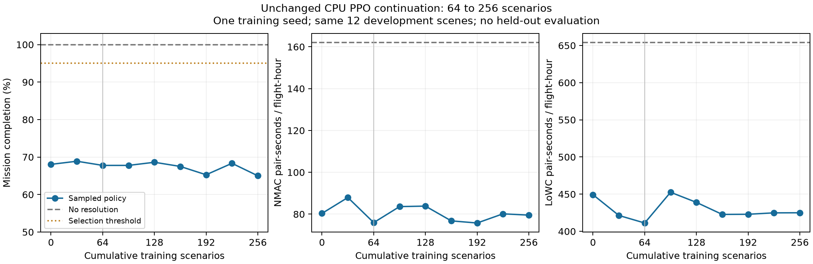

# 配置不变续训：64 → 256场景

2026-09-06 00:47 UTC，配置不变续训已完成256场景；未观察到稳定学习收益，尚无有效baseline。全部结果保留，未继续追加训练。

## 范围与固定设置

延续[64场景pilot](../parallel-pilot-20260905/README.md)的同一初始化种子和共享导航执行链，使用[原parallel配置](../../configs/paper_train_parallel.json)，仅通过CLI指定累计目标256和1980秒内部预算。源码、12个原开发场景、7/10维输入、60动作、奖励、PPO超参数及完成率优先的模型选择规则均保持。每四个完整场景冻结同一策略采样后更新，每32场景评价。当前仍是明确的同步并行PPO变体，不宣称与逐场景更新等价。

从latest64恢复模型/Adam/RNG/计数及嵌入best32。预定新增192场景、48次池化更新，训练场景seed9500064–9500255。先重放64，再评价96/128/160/192/224/256；仍只使用已经看过的12个DEV场景，不含held-out或多训练种子验证。没有自动追加延迟、扰动、奖励修改或安全过滤研究。

CPU12–15四个物理核、单线程PPO/BLAS、nice15/idleIO，单lab且无GPU；外部上限2040秒、512MiB输出软阈值、每进程4GiB虚拟地址限制。它们不是父子进程合计的硬RAM/磁盘配额。预估约24分钟，预算留完整评价余量。两个原有实验只作进程启动时间和资源的只读抽查。

## 复现本轮命令

```bash
nice -n 15 ionice -c 3 taskset -c 12-15 python3 -B tools/lab.py run \
  --label shared-parallel-continue256 --stage train \
  --config configs/paper_train_parallel.json \
  --seconds 2040 --disk-mib 512 --memory-mib 4096 \
  --input reports/policy-modes-refresh-850-20260905/scenarios.json \
  --input reports/parallel-pilot-20260905/checkpoints/latest.pt \
  --runtime "$PWD/.venv" --runtime "$PWD/environments/python" \
  -- "$PWD/.venv/bin/python" -B src/paper_train.py \
  --config configs/paper_train_parallel.json --episodes 256 --wall-seconds 1980 \
  --resume reports/parallel-pilot-20260905/checkpoints/latest.pt
```

配置文件本身保留原64/840声明用于严格恢复身份；实际累计目标和预算以本轮manifest命令与result的target/inner_wall_budget字段为准。若后续再延长，也应显式声明新的有界目标与预算，不修改检查点身份来强行恢复。

## 核查与产物

训练结束后，控制器以独立串行lab运行[summarize.py](summarize.py)归约旧64与本轮数据，计数/固定场景/暴露分母/恢复64逐case数据/选择规则/保存模型核查全部通过，并生成JSON、PNG与PDF。动作边际统计包含锁定时重复选择的既有目标，不能当作新机动概率；PPO日志中的更新统计用于诊断，不是避碰有效性的替代。

本轮训练源码与配置没有修改，沿用此前40项回归和真实8连续与4+恢复8验证；不重复启动同样测试。实际本轮证据由结果与归约生成，旧测试本身不证明256轮学习效果。

## 开发结果

同一初始化种子，固定原12个开发场景，每个检查点计划360架次。NMAC/LoWC单位均为无向pair暴露秒/真实飞行小时，按暴露总和除以航时总和；不是每场景比例的平均。初始64重放与旧64逐case科学字段、动作直方图和全部aggregate精确一致，比较排除计时与进程RSS字段；所有检查点NR聚合相同。

| 累计训练场景 | 完成架次 | 完成率 | NMAC秒/FH | LoWC秒/FH | 超时 | 路线耗尽 |
| ---: | ---: | ---: | ---: | ---: | ---: | ---: |
| 0 | 245/360 | 68.06% | 80.356 | 449.290 | 53 | 62 |
| 32 | 248/360 | 68.89% | 87.954 | 421.381 | 53 | 59 |
| 64 | 244/360 | 67.78% | 75.954 | 411.223 | 53 | 63 |
| 96 | 244/360 | 67.78% | 83.609 | 452.565 | 53 | 63 |
| 128 | 247/360 | 68.61% | 83.841 | 438.963 | 53 | 60 |
| 160 | 243/360 | 67.50% | 76.787 | 422.761 | 53 | 64 |
| 192 | 235/360 | 65.28% | 75.765 | 422.987 | 53 | 72 |
| 224 | 246/360 | 68.33% | 80.148 | 424.866 | 53 | 61 |
| 256 | 234/360 | 65.00% | 79.532 | 424.995 | 53 | 73 |

NR为360/360、NMAC162.103、LoWC654.129。未训练策略本来就比NR有较低暴露，伴随明显任务失败；不能把策略相对NR的全部差异归功于学习。

256相对64少完成10架，NMAC率上升4.71%、LoWC上升3.35%；相对初始少完成11架，NMAC率仅下降1.03%、LoWC下降5.41%。多个检查点持续波动，没有稳定的完成率和安全收益。全九个候选均未达到95%完成门槛；完成率优先规则仍选best32（248/360），并不代表它是最佳安全策略或有效基线。不冻结做延迟收益实验，也不据单种子256场景判定原文算法不能收敛。

失败未删减：本轮64到256超时均53，路线耗尽63→73，正好对应少完成10架；这定位了终止分类变化，尚未证明其具体动作/机型因果。最终横向越界339架、43491飞机秒，垂向0，全部原始指标仍保存；用户要求先搁置越界研究，本轮没有改观测、奖励或引入过滤器。



[可导出PDF](records/20260906T004847Z-parallel-continue256-summary-f182bd7a/artifacts/learning-curve.pdf) · [完整JSON汇总](records/20260906T004847Z-parallel-continue256-summary-f182bd7a/artifacts/summary.json)。曲线包含先前0/32/64与本轮新增六点评价，64竖线标记恢复位置；没有独立测试或多训练种子置信区间。

## 训练诊断与资源

本轮新增192场景/5760计划架次、48池化更新、794104样本、12433次Adam小批次步；累计256场景/7680计划架次、64池化更新、1055487样本、16524次Adam步。训练seed9500064–9500255全部连续，完整四场景按绝对序号排序，样本访问/epoch1/minibatch64计数均正确。

本轮内部1434.591s、外部约1436.51s（00:23:30.868–00:47:27.380 UTC），到达256目标并完成终评。活跃采样/IPC/PPO551.698s，平均11.494s/批、1439.38样本/s；七次评价847.678s，池启动25.962s。所有时间包含项目真实记录范围，未声称与逐场景PPO的等价加速。

32场景窗口的PPO平均熵约2.22，最终窗口approx_KL约2.03e-5，全部更新clip_fraction为0。速度目标1.05倍的DEV决策占比从初始25.40%到最终27.51%，其他目标仍分散。梯度裁剪后的范数接近0.5；这些是已保存日志事实，只提示策略变化较小、值得检查梯度/优势与奖励组成，不能单凭它们认定学习率太低或优化器失效。动作分布包含锁中重复目标，熵也受合法动作mask和场景状态影响；不将它们解释为未约束的60类均匀探索。

[启动前](host-before.json)、[中途两次](host-during.jsonl)、[结束后](host-after.json)抽样中保护PID3059945/3062529的启动ticks均为348614026/348620130；两个原有实验持续存活，没有向其发信号、修改优先级或环境。GPU占用前后20886MiB/free3162MiB，当前训练没有GPU设备。可用RAM抽样约58.6–60.8GiB，单worker峰值RSS578.30MiB；这些抽样不能证明其他实验短时吞吐完全不受共享资源影响。

## 保存与下一步

- [latest256](checkpoints/latest.pt)：本轮最终模型/Adam/RNG/严格配置与版本，内嵌best32；后续恢复点。
- [best32](checkpoints/best.pt)：原预定选择规则保留，独立文件与latest内嵌完整checkpoint精确一致。
- [训练manifest](records/20260906T002330Z-shared-parallel-continue256-f69175ea/manifest.json)、[result](records/20260906T002330Z-shared-parallel-continue256-f69175ea/artifacts/result.json)、[逐批训练](records/20260906T002330Z-shared-parallel-continue256-f69175ea/artifacts/training.jsonl)、[逐场景评价](records/20260906T002330Z-shared-parallel-continue256-f69175ea/artifacts/development.jsonl)。
- [归约manifest](records/20260906T004847Z-parallel-continue256-summary-f182bd7a/manifest.json)、[归约状态](records/20260906T004847Z-parallel-continue256-summary-f182bd7a/status.json)、[备份索引](backup-index.json)。15份明确产物共3125241字节，含两个模型及PNG/PDF，源/副本字节和SHA全部核对。完整source目录与临时导航缓存仍只在本机runs，未声称全量异地备份。

训练与归约两个lab job均成功；首次归约误用runs直接输入被launcher预检拒绝，尚未启动负载。按现有隔离规则先复制明确产物到reports并核对字节，重新只读输入后通过；没有降低隔离或修改训练结果。归约00:48:51.793 UTC结束，无遗留本轮训练。

下一步建议先作有界学习诊断：按机型/接受动作/剩余航程细分超时和路线耗尽，检查安全/效率/到达奖励分量、优势与actor/value梯度，结合已经保存的动作mask/分布确定最小对照。原因尚待验证；本轮不静默修改奖励、输入或PPO，不直接无限追加轮次，不把越界研究重新作为前置。
